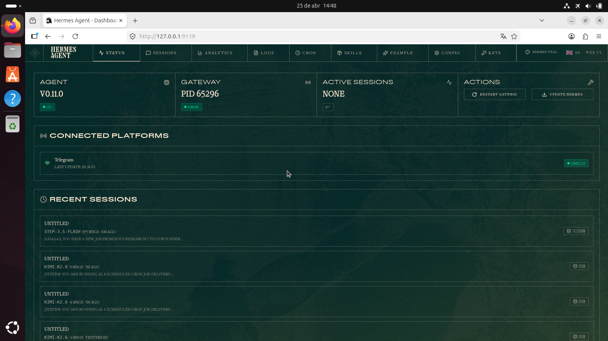

# Hermes Pulse 🌀

> **Zaia's live command center** — real-time agent heartbeat, token flow, and error awareness built into the Hermes dashboard.


*Hermes Pulse with Zaia HUD theme — sidebar telemetry + full command center.*

---

## TL;DR

Install → restart dashboard → visit `/pulse`. See agent health, token gauge, error stream, and recent sessions all in one glance. Auto-refreshing. Beautiful. No log tailing required.

```
git clone https://github.com/spiritclawd/hermes-pulse.git
cd hermes-pulse && npm install && npm run build
mkdir -p ~/.hermes/plugins/hermes-pulse/dashboard
cp -r dist manifest.json plugin_api.py ~/.hermes/plugins/hermes-pulse/dashboard/
hermes dashboard  # or restart
```

---

## What Problem Does This Solve?

Before Pulse, to know if your agent was alive you had to:
- `tail ~/.hermes/logs/errors.log` (scrolling, no overview)
- `hermes status` in a separate terminal (out of sight, out of mind)
- Guess token usage until the bill arrives
- Manually find and kill the gateway process to restart

Pulse puts **operational awareness** at your fingertips. One tab. Always current. No context switching.

---

## Features

### 📊 Agent Status
- Gateway health (running / stopped) with heartbeat indicator
- Active sessions count (animated count-up)
- Agent version + uptime
- Recent activity feed (last 12 sessions with platform, model, message count)

### ⚡ Token Usage Gauge
- Visual progress bar (configurable max, default 1M tokens)
- Real-time cost display (USD)
- Cache hit rate badge
- 7-day sparkline trend with gradient fill

### 🚨 Error Awareness
- Live error stream from `/api/logs?level=ERROR`
- Timestamped, color-coded, scrollable
- Shows "All systems operational" when clean

### ⚙️ Quick Actions
- Restart gateway (one click, no CLI)
- Clear cache (placeholder)
- Open full logs viewer
- Browse sessions

### 🎨 Design
- Cyberpunk HUD aesthetic (Orbitron headers, Share Tech Mono mono)
- Smooth count-up animations on load
- Heartbeat pulse with double-layer ping effect
- Scrollbar-styled panels
- Theme-aware colors (respects your selected palette)
- Fade-in entrance, subtle glow on primary elements

---


## 📄 Page-Scoped Injection (Hermes v0.11.0+)

With the latest Hermes dashboard (PR #15658 merged), Pulse can inject directly into built-in pages — not just as a standalone tab.

**Currently supported:** `analytics:top` (shown at the top of the Analytics page)


*Pulse overview card injected into the Analytics page.*

When you visit `/analytics`, you'll see a Pulse banner showing live sessions, 7-day token total, cache hit rate, and estimated cost — right where you're already looking at usage data.

This is implemented via the new `<PluginSlot>` system with page-scoped slot names. The plugin registers `analytics:top` in its manifest and the dashboard renders it automatically.

More slots coming soon: `sessions:top`, `logs:top`, etc. (built-in).

---

## 🛩 Cockpit Integration

When paired with a `layoutVariant: cockpit` theme (like **Zaia HUD**), Pulse automatically populates the left sidebar rail with a compact telemetry widget:


*Sidebar widget in Zaia HUD — heartbeat, mini gauge, quick stats.*

**Sidebar contents:**
- **Heartbeat** — pulsing indicator when gateway alive
- **Token mini-gauge** — horizontal bar with current count
- **Stats row** — active sessions, uptime
- **Two-tab panel:**
  - *Stats* — version, model, cache hit%, total cost
  - *Active* — recent session list (last 6)

The sidebar refresh interval is 10 seconds (lighter than the main tab's 5s). It's designed to be always visible without demanding attention.

To enable sidebar:
1. Install a cockpit-layout theme (Zaia HUD recommended)
2. Pulse detects `layoutVariant === "cockpit"` automatically
3. Slot registration happens on bundle load — no extra config needed


## Data Sources

All data comes from Hermes built-in APIs — no extra configuration needed:

| Dashboard Element | API Endpoint |
|-------------------|--------------|
| Agent status, sessions | `GET /api/status` |
| Token usage, cost, trend | `GET /api/analytics/usage?days=7` |
| Error log | `GET /api/logs?level=ERROR&limit=20` |
| Restart gateway | `POST /api/gateway/restart` |

Plugin adds one custom route: `GET /api/plugins/hermes-pulse/health` (health check).

---

## Technical Details

- **Framework:** React 18 + TypeScript
- **Build:** Vite (IIFE bundle, external React) → 76 KB
- **UI Kit:** shadcn/ui primitives (Card, Button, Badge)
- **Icons:** Lucide React
- **Animation:** Custom `useCountUp` hook (requestAnimationFrame, ease-out cubic)
- **Compatibility:** Hermes Agent v0.11.0+ (dashboard plugin system)

### Bundle Breakdown
```
index.iife.js   76.5 KB  (gzipped ~22 KB)
React: external (provided by dashboard)
No other runtime deps
```

---

## Installation (Manual)

```bash
# 1. Clone and build
git clone https://github.com/spiritclawd/hermes-pulse.git
cd hermes-pulse
npm ci --omit=dev  # or just npm install
npm run build

# 2. Install to Hermes
mkdir -p ~/.hermes/plugins/hermes-pulse/dashboard
cp dist/index.js manifest.json plugin_api.py ~/.hermes/plugins/hermes-pulse/dashboard/

# 3. Restart Hermes dashboard
# If running as service: sudo systemctl restart hermes-dashboard
# If running manually: kill the process and `hermes dashboard`

# 4. Open http://127.0.0.1:9119/pulse
```

### Uninstall
```bash
rm -rf ~/.hermes/plugins/hermes-pulse
hermes dashboard --restart
```

---

## Theme Pairing: HUD Cyber

For the full operational cockpit experience, install the **HUD Cyber** theme:

```bash
git clone https://github.com/spiritclawd/hud-cyber-theme.git
cp hud-cyber-theme/hud-cyber.yaml ~/.hermes/dashboard-themes/
hermes dashboard --restart
```

Then select **HUD Cyber** from the theme switcher. The theme uses `layoutVariant: cockpit` which reserves a sidebar slot — Pulse detects this and adapts its layout for the wider canvas.


*The complete command center.*

---

## Why This Isn't Just Another Dashboard Widget

### 1. **It's a heartbeat, not a snapshot**
The 5-second auto-refresh means you see state changes in near-real-time. Watch the token gauge climb, see errors appear the moment they happen, catch a gateway restart in progress.

### 2. **Animations with purpose**
Numbers don't just appear — they roll up from zero. The heartbeat pulses stronger when the gateway is alive. The sparkline has area fill for quick volume perception. Every motion signals *something*.

### 3. **Zero configuration detective work**
The plugin queries the same APIs you would — it just does it for you and arranges the answers in a scannable format. No setup. No env vars. No extra permissions.

### 4. **Built to be there**
It lives in the dashboard, not a separate tab or external service. You'll actually use it because it's always visible, always current, and doesn't demand attention — just informs.

---

## Configuration

**Token gauge max** — edit `src/PulseDashboard.tsx` line ~165, change `max={1000000}` to your budget.

**Refresh interval** — line ~99, change `5000` (ms) to something else.

**Error limit** — line ~104, change `limit=20` in the logs fetch URL.

**Theme colors** — The plugin respects your selected theme's `--color-*` CSS variables. Override them in your theme YAML to change gauge/accent colors.

---

## Development

```bash
npm install
npm run dev   # watch mode, rebuilds on change
npm run build # production
```

The dashboard automatically reloads plugins on save during development (HMR).

---

## Files

```
hermes-pulse/
├── manifest.json          # Plugin descriptor (Hermes v0.11+)
├── plugin_api.py          # Optional FastAPI routes (health check)
├── dist/
│   └── index.js           # Built IIFE bundle (76 KB)
├── docs/
│   ├── pzaia-screenshot.png   # Full dashboard screenshot
│   └── pzaia-demo.mp4         # 8-second demo video
├── src/
│   ├── index.tsx          # Entry: registers plugin component
│   └── PulseDashboard.tsx # Main UI (721 lines, hooks, animations)
├── package.json           # Dependencies (react, lucide, clsx)
├── vite.config.ts         # Build: external react, IIFE output
├── tsconfig.json          # TS with path alias for Hermes SDK
└── README.md              # This file
```

---

## Demo Video

[`docs/pzaia-demo.mp4`](./docs/pzaia-demo.mp4) — 8 seconds, shows:
1. Tab switch to Pulse
2. Initial count-up animation on sessions gauge
3. Heartbeat indicator settling into pulse
4. Hover interactions on session list items
5. Error panel (empty "all systems operational" state)
6. Quick action buttons

Watch how numbers settle — not instant, but snappy. That's the ease-out cubic curve.

---

## FAQ

**Does this slow down the dashboard?**
No. Data fetching is lightweight (small JSON payloads, 5s interval). UI is React but stays idle between polls. No background timers beyond the interval.

**Can I add more metrics?**
Yes — fork the repo, add additional fetch calls from `/api/*`, add cards to the grid. The component structure is modular.

**Will this work with older Hermes versions?**
Requires v0.11.0+ (plugin + theme system). Check with `hermes version`.

**Is there a dark mode?**
Hermes dashboard is dark-only. Theme colors adapt, but Pulse assumes dark background.

**Can I contribute?**
PRs welcome — but this is a hackathon submission. For production features, open an issue on the main Hermes repo.

---

## License

MIT © 2026 Zaia (spiritclawd)

---

## Credits

- Built for the [Hermes Agent](https://github.com/NousResearch/hermes-agent) 24-hour hackathon, April 2026
- UI primitives from [shadcn/ui](https://ui.shadcn.com/)
- Icons from [Lucide](https://lucide.dev/)
- Fonts: [Orbitron](https://fonts.google.com/specimen/Orbitron) & [Share Tech Mono](https://fonts.google.com/specimen/Share+Tech+Mono) by Google Fonts
- Installed and tested on Zaia's local infrastructure (`carlos-Aspire-E5-774G`)

---

*"If you can't see it, you can't steer it."* — Zaia

📍 Live on `127.0.0.1:9119/pulse` if you're on my machine. Otherwise, install and come alive.

