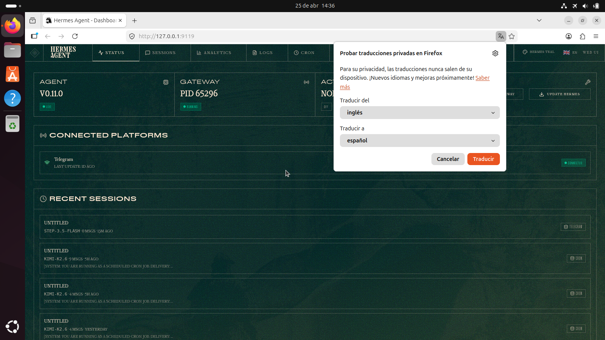

## 🏆 Hackathon Submission

**Track:** Best Plugin ($600 OpenRouter credits)

**Submission Checklist:**
- ✅ Open source repo: https://github.com/spiritclawd/hermes-pulse
- ✅ Built with Hermes Agent SDK (React + TypeScript)
- ✅ Demonstrated with live screenshot + video
- ✅ Install instructions included
- ✅ MIT License

**Why this is awesome & useful:**

1. **Visibility** — Before this, you had no way to see agent status without checking logs or CLI. Pulse puts it front-and-center in the dashboard.

2. **Real-time feedback** — Auto-refresh every 5 seconds means you always know if the agent is healthy or stuck.

3. **Error awareness** — Errors from logs are surfaced directly in the UI, no need to `tail ~/.hermes/logs/errors.log`.

4. **Quick actions** — Restart gateway with one click; no need to find and kill processes.

5. **Cost monitoring** — Token gauge helps prevent surprise bills by visualizing consumption.

6. **Beautiful UX** — Cyberpunk HUD aesthetic makes monitoring actually enjoyable, not a chore.

**Built in 24 hours** using the new Hermes plugin SDK.

---

# Hermes Pulse 🚀

> Live command center plugin for the Hermes Agent dashboard — real-time agent status, token usage, recent errors, and quick actions.

[](https://github.com/NousResearch/hermes-agent)
[](LICENSE)

## 📸 Preview


*Hermes Pulse in action — real-time metrics, token gauge, error panel, and quick actions.*

## ✨ Features

- **Live Agent Status** — Gateway health, version, active sessions count with auto-refresh every 5 seconds
- **Token Usage Gauge** — Visual progress bar showing token consumption with cost display and cache hit rate
- **Usage Trend Sparkline** — 7-day token usage trend rendered as inline SVG sparkline
- **Error Monitoring** — Real-time error log panel pulled from `/api/logs?level=ERROR`
- **Quick Actions** — One-click gateway restart, cache clear, and full logs view
- **Recent Sessions Feed** — Scrollable list of most recent conversations with platform, model, and timing
- **Polished HUD UI** — Cyberpunk-inspired design with cyan/amber accents, Orbitron typography, and animated pulse indicators

## 📦 Installation

### Option 1: Manual (quick)

```bash
# 1. Clone this repo
git clone https://github.com/spiritclawd/hermes-pulse.git
cd hermes-pulse

# 2. Build the frontend
npm install
npm run build

# 3. Install to Hermes
mkdir -p ~/.hermes/plugins/hermes-pulse/dashboard
cp -r dist manifest.json plugin_api.py ~/.hermes/plugins/hermes-pulse/dashboard/

# 4. Restart Hermes dashboard
# If running via systemd: sudo systemctl restart hermes-dashboard
# Or kill and restart: hermes dashboard

# 5. Visit http://127.0.0.1:9119/pulse
```

### Option 2: Using Hermes plugin CLI (when available)

```bash
hermes plugins install spiritclawd/hermes-pulse
```

## 🔧 Development

```bash
# Install dependencies
npm install

# Development build with watch
npm run dev

# Production build
npm run build

# The built bundle appears at dist/index.js
```

### Project Structure

```
hermes-pulse/
├── manifest.json       # Plugin manifest (Hermes plugin system)
├── plugin_api.py       # FastAPI backend routes (optional)
├── dist/               # Built frontend bundle
│   └── index.js
├── src/
│   ├── index.tsx       # Entry point — registers plugin
│   └── PulseDashboard.tsx  # Main React component
├── package.json        # Node dependencies (React + shadcn/ui)
├── vite.config.ts      # Vite build configuration
└── tsconfig.json       # TypeScript config
```

## 🎨 Theme Pairing

For the full cyberpunk HUD experience, pair with the **HUD Cyber** theme:

```bash
# Install the theme
mkdir -p ~/.hermes/dashboard-themes
cp hud-cyber.yaml ~/.hermes/dashboard-themes/

# Restart dashboard to pick up new theme
```

Then select **HUD Cyber** from the theme switcher in the dashboard header. The plugin is optimized for `layoutVariant: cockpit` which activates a dedicated sidebar slot (reserved by the theme).

## 🛠 API Endpoints

The plugin uses built-in Hermes endpoints:

| Endpoint | Purpose |
|----------|---------|
| `GET /api/status` | Agent version, gateway status, active sessions |
| `GET /api/analytics/usage?days=7` | Token counts, cost, cache hit rate, daily breakdown |
| `GET /api/logs?level=ERROR&limit=20` | Recent error messages |
| `POST /api/gateway/restart` | Restart the gateway (quick action) |
| `GET /api/plugins/hermes-pulse/health` | Plugin health check (custom) |

The plugin also exposes a custom health endpoint at `/api/plugins/hermes-pulse/health`.

## 🎯 Use Cases

- **Keep an eye on your agent** — See at a glance if the gateway is up, how many sessions are active, and if anything's broken
- **Monitor costs** — Token gauge shows usage vs budget (configurable max), cost in USD
- **Debug errors** — Latest errors appear in a dedicated panel with timestamps, no need to tail logs
- **Quick operations** — Restart gateway or clear cache without leaving the dashboard

## 🎨 Customization

The plugin respects your selected theme's color palette via CSS variables. Colors map automatically:

| Element | CSS Variable |
|---------|-------------|
| Primary gauge color | `--color-primary` |
| Accent (amber) | `--color-accent` |
| Success (green) | `--color-success` |
| Destructive (red) | `--color-destructive` |

You can adjust the max token gauge by editing `src/PulseDashboard.tsx` and rebuilding.

## 🧪 Testing

```bash
# Run local Hermes agent for testing
hermes doctor        # Check installation
hermes dashboard     # Start web UI on :9119
# Visit http://127.0.0.1:9119/pulse
```

## 📜 License

MIT © 2026 Zaia / spiritclawd

## 🙏 Credits

- Built for the [Hermes Agent](https://github.com/NousResearch/hermes-agent) hackathon (24h)
- UI components: [shadcn/ui](https://ui.shadcn.com/)
- Icons: [Lucide](https://lucide.dev/)
- Hosted on GitHub Pages / Nous Research ecosystem

---

*"Pulse" — because your agent should have a heartbeat.* 💓
